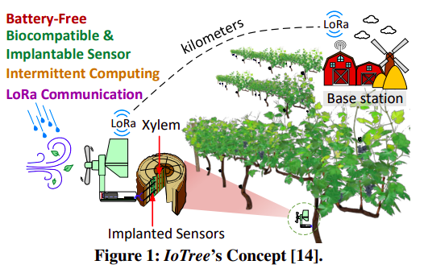
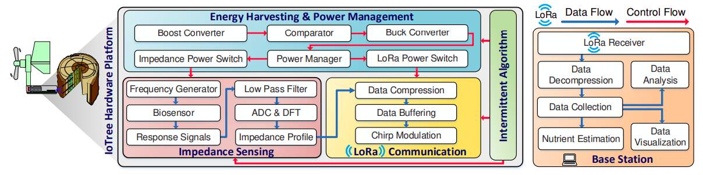
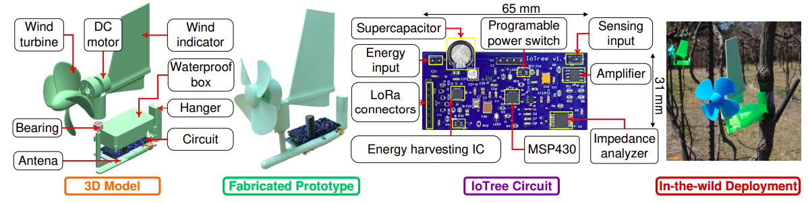

# IoTree: A Battery-free Wearable System with Biocompatible Sensors for Continuous Tree Health Monitoring
 
 # Overview
 
 
 # System Architecture
 
 
 # Prototype
 
 
# Paper: (https://dl.acm.org/doi/pdf/10.1145/3495243.3567652)

BibTeX
```
@inproceedings{dang2022iotree,
  title={ioTree: a battery-free wearable system with biocompatible sensors for continuous tree health monitoring},
  author={Dang, Tuan and Tran, Trung and Nguyen, Khang and Pham, Tien and Pham, Nhat and Vu, Tam and Nguyen, Phuc},
  booktitle={Proceedings of the 28th Annual International Conference on Mobile Computing And Networking},
  pages={352--366},
  year={2022}
}
```


